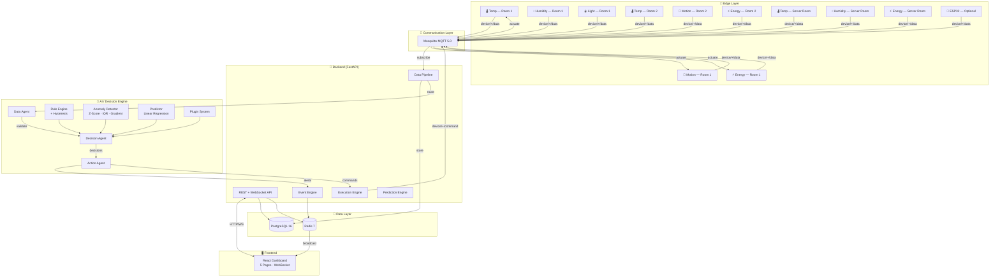
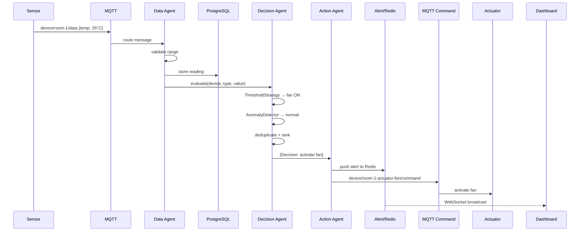

# ──────────────────────────────────────────────────────────────
#  🧠 EdgeBrain — AI-Powered Edge Intelligence Platform
# ──────────────────────────────────────────────────────────────
#
#  Autonomous real-world decision systems. 100% local. Zero paid APIs.
#
#  https://github.com/rudra496/EdgeBrain
#
# ──────────────────────────────────────────────────────────────

<div align="center">


<br /><br />

**The most comprehensive open-source edge AI platform.**

**Simulate → Process → Decide → Act — all locally, all free.**

[](https://github.com/rudra496/EdgeBrain/actions)
[](https://github.com/rudra496/EdgeBrain/releases)
[](LICENSE)
[](https://hub.docker.com/)
[](https://python.org)
[](https://fastapi.tiangolo.com)
[](https://react.dev)
[](https://postgresql.org)
[](https://redis.io)
[](https://mqtt.org)
[](https://github.com/rudra496/EdgeBrain/stargazers)
[](https://github.com/rudra496/EdgeBrain/network/members)
[](https://github.com/rudra496/EdgeBrain/issues)
[]()
[]()
[]()
[]()

<br />

<sup>Zero paid APIs · Zero cloud lock-in · Zero proprietary dependencies</sup>

</div>

---

## 🎬 Demo

```bash
# Clone & run in under 2 minutes
git clone https://github.com/rudra496/EdgeBrain.git && cd EdgeBrain
docker compose up --build -d
# Open http://localhost:3000 — done.
```

**What you'll see:**
- 🌡️ Live temperature, humidity, energy, light charts
- 🤖 AI agents making decisions in real-time
- 🚨 Alerts firing when anomalies are detected
- 💡 Lights auto-on with motion, auto-off after 5 min
- 🌀 Fan activation when temperature exceeds 30°C
- 📊 Full agent message pipeline visualization

---

## ✨ Features

<details>
<summary><strong>🏠 Smart Device Simulation (11 devices)</strong></summary>

- **3 rooms** — Living Room (5 sensors), Bedroom (3 sensors), Server Room (3 sensors)
- **5 sensor types** — Temperature, Motion, Energy, Humidity, Light
- **Realistic patterns** — circadian rhythms, Gaussian noise, mean reversion
- **Rare event simulation** — temperature spikes (1%), energy surges (0.5%)
- **Configurable** — base values, noise scale, spike probability per device
- **Time-aware** — energy peaks during work hours, light follows sunrise/sunset

</details>

<details>
<summary><strong>🤖 Multi-Agent AI System</strong></summary>

- **Data Agent** — validates ranges, stores readings, routes to decision pipeline
- **Decision Agent** — runs all strategies, deduplicates, ranks by confidence
- **Action Agent** — creates alerts, sends MQTT commands, updates actuator state
- **Message Bus** — full queryable log with agent performance tracking
- **Per-agent metrics** — average processing time, message count, error rate

</details>

<details>
<summary><strong>🧠 AI Decision Engine (3 strategies)</strong></summary>

- **Threshold Rules** — configurable per device type, with hysteresis to prevent flapping
- **Anomaly Detection** — 3 statistical methods vote: Z-Score, IQR, Gradient
  - Requires 2+ methods to agree (reduces false positives by ~70%)
- **No-Motion Timeout** — turns off lights after configurable inactivity period
- **Plugin Architecture** — add custom strategies via `DecisionStrategy` interface
  - Just implement `evaluate()` and `name` — that's it

</details>

<details>
<summary><strong>📈 Predictive Analytics</strong></summary>

- **Trend Prediction** — linear regression on recent readings to forecast next value
- **Moving Averages** — SMA and EMA for smoothing noisy sensor data
- **Anomaly Score** — combined confidence from all detection methods
- **Forecasting** — 10-step ahead prediction for temperature and energy

</details>

<details>
<summary><strong>📊 Real-Time Dashboard (5 pages)</strong></summary>

- **Dashboard** — stats overview, live charts, event feed, recent alerts
- **Devices** — all sensor states with room grouping, online/offline status
- **Analytics** — historical charts, trend predictions, device comparisons
- **Agents** — pipeline visualization, message log, strategy config, performance
- **Settings** — system configuration, thresholds, export data, system info

</details>

<details>
<summary><strong>🔌 Communication & Integration</strong></summary>

- **MQTT 5.0** — topic-based architecture with QoS support
- **WebSocket** — real-time bidirectional dashboard updates
- **REST API** — 20+ endpoints with auto-generated OpenAPI docs
- **Data Export** — CSV and JSON export for any device's readings
- **Webhook Support** — configurable webhook for alert notifications

</details>

<details>
<summary><strong>🏗️ Production Infrastructure</strong></summary>

- **Docker Compose** — 6 services, health checks, restart policies, volumes
- **PostgreSQL** — composite indexes, JSONB fields, time-series optimized
- **Redis** — event queuing, pub/sub, alert cache, live telemetry
- **GitHub Actions** — CI (tests + lint) + Release (Docker + Git tag)
- **Makefile** — one-command operations: `make dev`, `make test`, `make release`

</details>

<details>
<summary><strong>🔧 Optional Hardware</strong></summary>

- **ESP32 firmware** — Arduino C++ with WiFi + MQTT
- **DHT11** — temperature & humidity sensor
- **PIR** — passive infrared motion sensor
- **LED + Buzzer** — actuator control
- **Configurable** — just edit WiFi + MQTT credentials

</details>

---

## ⚡ Quick Start

### Prerequisites
- [Docker](https://docs.docker.com/get-docker/) v20+ & [Docker Compose](https://docs.docker.com/compose/install/) v2+
- 4GB RAM (8GB recommended)
- ~2GB disk space

### Install & Run

```bash
git clone https://github.com/rudra496/EdgeBrain.git
cd EdgeBrain
docker compose up --build -d
```

### Or use Make

```bash
make setup        # Clone (if not already), build, and start
make dev          # Start in development mode
make test         # Run test suite
make logs         # Tail all service logs
make stop         # Stop all services
make clean        # Stop + remove volumes
```

### Access Points

| Service | URL | Description |
|---------|-----|-------------|
| 🖥️ **Dashboard** | http://localhost:3000 | React real-time dashboard |
| 📡 **Swagger API** | http://localhost:8000/docs | Interactive API explorer |
| 📖 **ReDoc** | http://localhost:8000/redoc | Alternative API docs |
| ❤️ **Health** | http://localhost:8000/api/v1/health | System health check |
| 🐝 **MQTT** | `localhost:1883` | Mosquitto broker |
| 📡 **MQTT/WS** | `localhost:9001` | MQTT over WebSocket |

### Verify Everything

```bash
# Health check
curl -s http://localhost:8000/api/v1/health | python3 -m json.tool

# System statistics
curl -s http://localhost:8000/api/v1/stats | python3 -m json.tool

# Device list
curl -s http://localhost:8000/api/v1/devices | python3 -m json.tool

# Recent alerts
curl -s http://localhost:8000/api/v1/alerts | python3 -m json.tool

# Agent performance
curl -s http://localhost:8000/api/v1/agents/stats | python3 -m json.tool
```

---

## 🏗️ Architecture



### Decision Pipeline



---

## 📁 Project Structure

```
EdgeBrain/
├── .github/
│   ├── ISSUE_TEMPLATE/
│   │   ├── bug_report.yml          # Structured bug reports
│   │   └── feature_request.yml     # Structured feature requests
│   └── PULL_REQUEST_TEMPLATE.md    # PR checklist
│
├── backend/
│   ├── app/
│   │   ├── api/
│   │   │   ├── routes.py           # 20+ REST endpoints + WebSocket
│   │   │   └── schemas.py          # Pydantic request/response models
│   │   ├── core/
│   │   │   ├── config.py           # Settings with env vars
│   │   │   ├── database.py         # SQLAlchemy engine + sessions
│   │   │   ├── mqtt_client.py      # Thread-safe MQTT with reconnect
│   │   │   └── events.py           # Redis queue + pub/sub
│   │   ├── ai/
│   │   │   ├── rules.py            # Rule engine + hysteresis + plugin
│   │   │   ├── anomaly.py          # Z-Score + IQR + Gradient detection
│   │   │   └── prediction.py       # Linear regression + forecasting
│   │   ├── agents/
│   │   │   └── multi_agent.py      # Data → Decision → Action pipeline
│   │   ├── models/
│   │   │   └── models.py           # 5 SQLAlchemy models + indexes
│   │   ├── services/
│   │   │   ├── ingestion.py        # Data validation + storage
│   │   │   └── execution.py        # Commands + alerts + actuator state
│   │   └── main.py                 # FastAPI app + lifespan
│   ├── tests/
│   │   ├── test_ai.py              # 20+ AI engine tests
│   │   └── test_api.py             # API endpoint tests
│   ├── requirements.txt
│   └── Dockerfile
│
├── frontend/
│   ├── src/
│   │   ├── App.js                  # Main app + 5-page router
│   │   ├── App.css                 # Complete dark theme design system
│   │   └── index.js                # React entry point
│   ├── public/index.html
│   ├── package.json
│   └── Dockerfile
│
├── device-simulator/
│   └── simulator.py                # 11 devices, 3 rooms, realistic data
│
├── esp32-firmware/
│   ├── main/main.ino               # ESP32 Arduino firmware
│   └── README.md                   # Hardware setup guide
│
├── docker/
│   ├── init.sql                    # Database schema + indexes
│   └── mosquitto.conf              # MQTT broker config
│
├── docs/
│   ├── ARCHITECTURE.md             # Detailed system design
│   ├── SETUP.md                    # Setup with/without Docker
│   └── ROADMAP.md                  # Development roadmap
│
├── Makefile                        # Convenience commands
├── docker-compose.yml              # 6-service orchestration
├── LICENSE                         # MIT
├── CODE_OF_CONDUCT.md              # CoC
├── CONTRIBUTING.md                 # Contribution guide
└── README.md                       # This file
```

---

## 🔌 Custom Strategies

```python
from app.ai.rules import DecisionStrategy, Decision

class MyCustomStrategy(DecisionStrategy):
    """Example: Alert when humidity exceeds threshold."""

    @property
    def name(self) -> str:
        return "humidity_alert"

    def evaluate(self, device_id, device_type, value, history):
        if device_type != "humidity":
            return []

        if value > 80:
            return [Decision(
                action="activate",
                device_id=device_id,
                params={"actuator": "alarm"},
                reason=f"High humidity: {value:.1f}%",
                confidence=0.85,
                severity="warning",
                source=self.name,
            )]
        return []

# Register:
from app.agents.multi_agent import agents
agents.engine.add_strategy(MyCustomStrategy())
```

---

## 🛠️ Tech Stack

| Layer | Technology | Version | Purpose |
|-------|-----------|---------|---------|
| **Backend** | Python | 3.11+ | Runtime |
| **Framework** | FastAPI | 0.110 | Async REST + WebSocket |
| **Database** | PostgreSQL | 16 | Time-series storage |
| **Cache** | Redis | 7.2 | Queue, pub/sub, cache |
| **Messaging** | Mosquitto | 2.0 | MQTT broker |
| **AI/Math** | NumPy + SciPy | 1.26 / 1.12 | Anomaly detection, prediction |
| **Frontend** | React | 18.3 | Dashboard UI |
| **Charts** | Recharts | 2.12 | Real-time visualizations |
| **Icons** | Lucide | 0.344 | Icon library |
| **Infra** | Docker Compose | 2.x | Local orchestration |
| **Hardware** | ESP32 | Arduino | Optional real sensors |

---

## 📖 Documentation

| Document | Description |
|----------|-------------|
| [Architecture](docs/ARCHITECTURE.md) | System design, data flow, plugin system |
| [Setup Guide](docs/SETUP.md) | Docker + native setup instructions |
| [Roadmap](docs/ROADMAP.md) | Future plans and milestones |
| [Contributing](CONTRIBUTING.md) | How to contribute code |
| [API Reference](http://localhost:8000/docs) | Interactive Swagger (when running) |

---

## 🚀 Release Strategy

Releases are versioned using [Semantic Versioning](https://semver.org/):

- **v1.x.x** — Current stable. Core features complete.
- **v2.x.x** — Planned: distributed edge, TimescaleDB, Grafana.
- **v3.x.x** — Planned: plugin marketplace, multi-tenant.

See [Releases](https://github.com/rudra496/EdgeBrain/releases) for changelog.

---

## 🤝 Contributing

We ❤️ contributions! See [CONTRIBUTING.md](CONTRIBUTING.md).

```bash
# Fork, branch, code, PR
git clone https://github.com/YOUR_USERNAME/EdgeBrain.git
cd EdgeBrain
make dev      # Start development environment
make test     # Run tests
# Make changes, then open PR
```

### Contributors

<!-- Thanks to all contributors! -->
<a href="https://github.com/rudra496/EdgeBrain/graphs/contributors">
  
</a>

---

## 📄 License

[MIT](LICENSE) — free for personal and commercial use.

---

## ⭐ Star History

<a href="https://star-history.com/#rudra496/EdgeBrain&Date">
 <picture>
   <source media="(prefers-color-scheme: dark)" srcset="https://api.star-history.com/svg?repos=rudra496/EdgeBrain&type=Date&theme=dark" />
   <source media="(prefers-color-scheme: light)" srcset="https://api.star-history.com/svg?repos=rudra496/EdgeBrain&type=Date" />
   
 </picture>
</a>

---

<div align="center">

**EdgeBrain** — Intelligence at the edge, not the cloud.

**Built with 🔧 by [Rudra](https://github.com/rudra496)**

</div>
