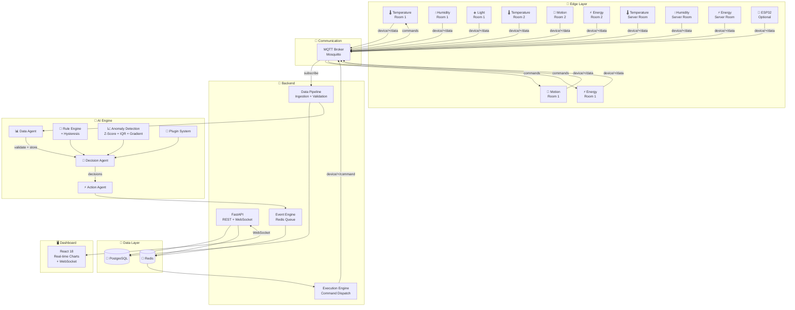

<div align="center">

# 🧠 EdgeBrain

### AI-Powered Edge Intelligence Platform

**Autonomous real-world decision systems. Running entirely on your local machine.**

[](LICENSE)
[](https://python.org)
[](https://fastapi.tiangolo.com)
[](https://react.dev)
[](https://postgresql.org)
[](https://redis.io)
[](https://mosquitto.org)
[](https://docker.com)
[]()
[]()
[](https://github.com/rudra496/EdgeBrain/actions)

<br />

**Zero paid APIs. Zero cloud dependencies. 100% open-source.**

Simulate IoT devices, process real-time data streams, run AI inference on CPU, make autonomous decisions, and control actuators — all from your laptop.

[Features](#-features) · [Quick Start](#-quick-start) · [Architecture](#-architecture) · [Demos](#-demos) · [Docs](#-documentation)

</div>

---

## ✨ Features

### 🏠 Smart Device Simulation
- **11 virtual IoT devices** across 3 rooms (temperature, motion, energy, humidity, light)
- Realistic data patterns — time-of-day cycles, noise, drift, and rare spikes
- Configurable parameters (base values, noise scale, spike probability)

### 🤖 Multi-Agent AI System
- **Data Agent** — validates, stores, and routes sensor readings
- **Decision Agent** — evaluates rules + statistical anomaly detection
- **Action Agent** — executes commands and triggers alerts
- Internal message bus with full queryable log

### 🧠 AI Decision Engine
- **Rule-based** threshold triggers with hysteresis (prevents flapping)
- **Statistical anomaly detection** using 3 methods: Z-Score, IQR, Gradient
- **Plugin architecture** — add custom decision strategies in minutes
- **No-motion timeout** — automatically turns off lights

### 📊 Real-Time Dashboard
- Live sensor charts (temperature, energy, humidity, light)
- Device status grid with online/offline indicators
- Alert feed with severity badges (info, warning, critical)
- Agent message log showing the full AI pipeline
- System statistics and performance metrics
- WebSocket-powered — instant updates, no polling

### 🔌 Communication
- **MQTT** topic-based architecture (`device/{id}/data`, `device/{id}/command`)
- Local Mosquitto broker — no external dependencies
- Thread-safe client with automatic reconnection

### 📐 Production Architecture
- **FastAPI** — async, auto-documented (Swagger + ReDoc)
- **PostgreSQL** — time-series storage with composite indexes
- **Redis** — event queuing and pub/sub for real-time notifications
- **Docker Compose** — one command to launch everything
- **GitHub Actions CI** — automated testing on every push

### 🔧 Optional Hardware
- **ESP32 firmware** included (C++/Arduino)
- Support for DHT11 temperature and PIR motion sensors
- LED and buzzer actuator control

---

## ⚡ Quick Start

### Prerequisites
- [Docker](https://docs.docker.com/get-docker/) + [Docker Compose](https://docs.docker.com/compose/install/)
- [Git](https://git-scm.com/)

### One Command

```bash
git clone https://github.com/rudra496/EdgeBrain.git
cd EdgeBrain
docker compose up --build -d
```

That's it. Wait ~30 seconds for everything to initialize.

### Access

| Service | URL | Description |
|---------|-----|-------------|
| 🖥️ **Dashboard** | http://localhost:3000 | Real-time React dashboard |
| 📡 **API Docs** | http://localhost:8000/docs | Interactive Swagger UI |
| 📖 **API Docs (alt)** | http://localhost:8000/redoc | ReDoc documentation |
| 🐝 **MQTT Broker** | `localhost:1883` | Mosquitto broker |
| 🗄️ **PostgreSQL** | `localhost:5432` | Database |
| 🔴 **Redis** | `localhost:6379` | Cache & event queue |

### Verify

```bash
# Check all containers
docker compose ps

# API health
curl http://localhost:8000/api/v1/health

# System stats
curl http://localhost:8000/api/v1/stats

# View devices
curl http://localhost:8000/api/v1/devices
```

### Stop

```bash
docker compose down        # Stop containers
docker compose down -v     # Stop + remove data
```

---

## 🏗️ Architecture



### Data Flow

```
Sensor → MQTT → Data Agent → PostgreSQL
                       ↓
                Decision Agent → [Rules] + [Anomaly]
                       ↓
                Action Agent → Alert (if warning/critical)
                            → MQTT Command → Actuator
```

---

## 🎮 Demos

All demos run automatically. Just start the system and watch.

### 🏠 Smart Room Automation
- Motion detected → **lights ON**
- No motion for 5 minutes → **lights OFF**
- Temperature > 30°C → **fan ON**
- Temperature < 25°C → **fan OFF**
- Temperature > 40°C → **alarm ON** (critical)

### 🌡️ Temperature Anomaly Detection
- Statistical baseline established from rolling window
- Z-Score + IQR + Gradient methods vote on anomalies
- 2+ methods agree → anomaly alert triggered
- Dashboard shows anomaly markers on temperature chart

### ⚡ Energy Monitoring
- Continuous consumption tracking with time-of-day patterns
- Higher consumption during 8am-6pm work hours
- Spike detection triggers warning alerts
- Server room monitored separately

### 🖥️ Dashboard Monitoring
- Live sensor charts update in real-time
- Device status grid shows online/offline
- Alert feed with severity levels
- Agent message log shows AI pipeline in action
- System statistics and performance metrics

---

## 📁 Project Structure

```
EdgeBrain/
├── backend/
│   ├── app/
│   │   ├── api/              # REST & WebSocket endpoints
│   │   │   └── routes.py     # 15+ API endpoints + WS handler
│   │   ├── core/             # Config, database, MQTT, events
│   │   ├── ai/               # Decision engine, anomaly detection
│   │   │   ├── rules.py      # Rule engine + plugin system
│   │   │   └── anomaly.py    # Z-Score + IQR + Gradient
│   │   ├── agents/           # Multi-agent system
│   │   │   └── multi_agent.py
│   │   ├── models/           # SQLAlchemy ORM models
│   │   ├── services/         # Business logic
│   │   └── main.py           # FastAPI application
│   ├── tests/                # pytest test suite
│   └── Dockerfile
├── frontend/
│   ├── src/
│   │   ├── App.js            # React dashboard (4 pages)
│   │   └── App.css           # Dark theme design system
│   └── Dockerfile
├── device-simulator/
│   └── simulator.py          # 11 devices across 3 rooms
├── esp32-firmware/
│   └── main/main.ino         # ESP32 C++ firmware
├── docker/
│   ├── init.sql              # Database schema
│   └── mosquitto.conf        # MQTT config
├── docs/
│   ├── ARCHITECTURE.md       # Detailed architecture guide
│   ├── SETUP.md              # Full setup instructions
│   └── ROADMAP.md            # Future plans
├── .github/
│   ├── workflows/ci.yml      # GitHub Actions CI
│   ├── ISSUE_TEMPLATE/       # Bug report + feature request
│   └── PULL_REQUEST_TEMPLATE.md
├── docker-compose.yml        # One-command setup
├── LICENSE                   # MIT
├── CODE_OF_CONDUCT.md
├── CONTRIBUTING.md
└── README.md
```

---

## 🔌 Adding Custom Decision Strategies

```python
from app.ai.rules import DecisionStrategy, Decision

class HumidityAlertStrategy(DecisionStrategy):
    @property
    def name(self) -> str:
        return "humidity_alert"

    def evaluate(self, device_id, device_type, value, history):
        if device_type == "humidity" and value > 80:
            return [Decision(
                action="activate",
                device_id=device_id,
                params={"actuator": "alarm"},
                reason=f"High humidity: {value}%",
                confidence=0.85,
                severity="warning",
                source=self.name,
            )]
        return []
```

Register it in the multi-agent system:

```python
from app.agents.multi_agent import agents
agents.engine.add_strategy(HumidityAlertStrategy())
```

---

## 🛠️ Tech Stack

| Layer | Technology | Why |
|-------|-----------|-----|
| **Backend** | Python 3.11 + FastAPI | Async, auto-docs, type-safe |
| **Database** | PostgreSQL 16 | Reliable, composite indexes |
| **Cache/Queue** | Redis 7 | Pub/sub, event queuing |
| **Messaging** | Eclipse Mosquitto (MQTT) | Lightweight IoT standard |
| **AI/ML** | NumPy + SciPy | CPU-only, no training needed |
| **Frontend** | React 18 + Recharts | Real-time charts, WebSocket |
| **Infrastructure** | Docker Compose | One-command local setup |
| **Hardware** | ESP32 (Arduino) | Optional real sensors |

---

## 📖 Documentation

| Doc | Description |
|-----|-------------|
| [Architecture](docs/ARCHITECTURE.md) | System design, data flow, plugin system |
| [Setup Guide](docs/SETUP.md) | Detailed setup with/without Docker |
| [Roadmap](docs/ROADMAP.md) | Future plans and milestones |
| [Contributing](CONTRIBUTING.md) | How to contribute |
| [API Docs](http://localhost:8000/docs) | Interactive Swagger UI (when running) |

---

## 🤝 Contributing

Contributions welcome! See [CONTRIBUTING.md](CONTRIBUTING.md).

1. Fork → Branch → Commit → Push → PR

```bash
git clone https://github.com/rudra496/EdgeBrain.git
# Make changes
# Open Pull Request
```

---

## 📜 License

[MIT](LICENSE) — use it, modify it, ship it.

---

<div align="center">

**EdgeBrain** — Intelligence at the edge, not the cloud.

Built with 🔧 by [Rudra](https://github.com/rudra496)

</div>
