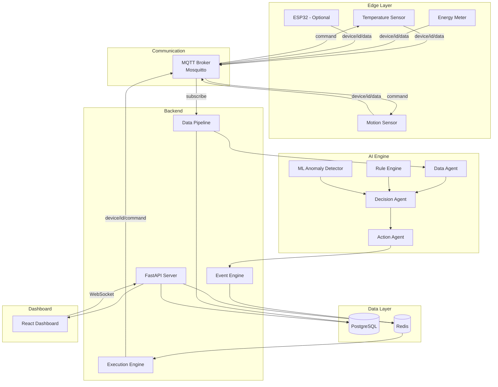

# ──────────────────────────────────────────────
# EdgeBrain — AI-Powered Edge Intelligence Platform
# ──────────────────────────────────────────────

[](LICENSE)
[](https://python.org)
[](https://fastapi.tiangolo.com)
[](https://react.dev)
[](https://docker.com)
[]()

> **Autonomous real-world decision systems running entirely on your local machine.**
> No paid APIs. No cloud lock-in. Just open-source intelligence at the edge.

---

## 🌟 What is EdgeBrain?

EdgeBrain is a production-grade, modular platform that simulates IoT devices, processes real-time data streams, runs AI inference on CPU, makes autonomous decisions, and controls actuators — all **100% locally**.

Think of it as a **brain for physical spaces**: it watches sensors, thinks, and acts.

### Real-World Use Cases

| Demo | Description |
|------|-------------|
| 🏠 **Smart Room** | Auto-adjusts fans/lights based on temperature & occupancy |
| 🌡️ **Temperature Alerts** | Anomaly detection triggers alarms before equipment fails |
| ⚡ **Energy Monitor** | Tracks power consumption patterns and predicts spikes |

---

## 🏗️ Architecture



---

## ⚡ Quick Start (Under 5 Minutes)

### Prerequisites
- [Docker](https://docs.docker.com/get-docker/) + [Docker Compose](https://docs.docker.com/compose/install/)
- [Git](https://git-scm.com/)

### One Command to Run Everything

```bash
git clone https://github.com/rudra496/EdgeBrain.git
cd EdgeBrain
docker compose up --build -d
```

That's it. Everything starts:

| Service | URL |
|---------|-----|
| 🖥️ Dashboard | http://localhost:3000 |
| 📡 API Docs | http://localhost:8000/docs |
| 🐝 MQTT Broker | localhost:1883 |
| 🗄️ PostgreSQL | localhost:5432 |
| 🔴 Redis | localhost:6379 |

### Stop Everything

```bash
docker compose down
```

---

## 📁 Project Structure

```
EdgeBrain/
├── backend/
│   ├── app/
│   │   ├── api/              # REST & WebSocket endpoints
│   │   ├── core/             # Config, database, MQTT client
│   │   ├── ai/               # Decision engine, agents, ML models
│   │   ├── models/           # SQLAlchemy models
│   │   ├── services/         # Business logic services
│   │   └── agents/           # Multi-agent system
│   ├── migrations/
│   ├── tests/
│   ├── requirements.txt
│   └── Dockerfile
├── frontend/
│   ├── src/
│   │   ├── components/       # React components
│   │   ├── pages/            # Page views
│   │   ├── hooks/            # Custom React hooks
│   │   └── utils/            # Helpers
│   ├── package.json
│   └── Dockerfile
├── device-simulator/
│   └── simulator.py          # IoT device simulator
├── esp32-firmware/
│   └── main/                 # ESP32 C++ firmware
├── docker/
│   └── init.sql              # Database init script
├── docker-compose.yml
├── docs/
│   ├── ARCHITECTURE.md
│   ├── SETUP.md
│   └── ROADMAP.md
├── .github/                  # Issue & PR templates
├── LICENSE
└── README.md
```

---

## 🧩 Core Modules

### 1. Device Simulator
Generates realistic sensor data (temperature, motion, energy) and streams via MQTT.

### 2. Communication Layer
Local Mosquitto MQTT broker with topic-based routing:
- `device/{id}/data` — sensor readings
- `device/{id}/command` — actuator commands

### 3. AI / Decision Engine
- **Rule Engine** — threshold-based triggers (e.g., temp > 40°C → alarm)
- **ML Anomaly Detector** — Z-score based anomaly detection on CPU
- **Plugin System** — add custom decision strategies via strategy interface

### 4. Multi-Agent System
- **Data Agent** — processes and validates incoming sensor data
- **Decision Agent** — evaluates rules & ML model output
- **Action Agent** — generates and executes actuator commands

### 5. Dashboard
Real-time React dashboard with:
- Live sensor charts
- Device status panel
- Alert feed
- Actuator controls

---

## 🎮 Running the Demos

All three demos run automatically when you start the system.

### 🏠 Smart Room Automation
- Motion detected → lights ON
- No motion for 5 min → lights OFF
- Temperature > 30°C → fan ON
- Temperature < 25°C → fan OFF

### 🌡️ Temperature Alert System
- Anomaly detection on temperature stream
- Statistical deviation from baseline → alarm triggered
- Dashboard shows anomaly markers on chart

### ⚡ Energy Monitoring
- Continuous energy consumption tracking
- Spike detection (>2σ from rolling mean)
- Weekly summary statistics

---

## 🔧 Tech Stack

| Layer | Technology |
|-------|-----------|
| Backend | Python 3.11+, FastAPI |
| Messaging | Eclipse Mosquitto (MQTT) |
| Database | PostgreSQL |
| Cache/Queue | Redis |
| Frontend | React 18, Recharts |
| AI/ML | Pure Python (NumPy, SciPy) — CPU only |
| Infrastructure | Docker, Docker Compose |
| Hardware (optional) | ESP32 via Arduino Framework |

---

## 🤝 Contributing

We love contributions! See [CONTRIBUTING.md](CONTRIBUTING.md) for guidelines.

1. Fork the repo
2. Create a feature branch (`git checkout -b feature/amazing`)
3. Commit your changes (`git commit -m 'Add amazing feature'`)
4. Push to the branch (`git push origin feature/amazing`)
5. Open a Pull Request

---

## 📜 License

This project is licensed under the MIT License — see [LICENSE](LICENSE) for details.

---

## 🙌 Acknowledgments

- Built with [FastAPI](https://fastapi.tiangolo.com), [React](https://react.dev), and [Mosquitto](https://mosquitto.org)
- Inspired by the need for truly local, privacy-first edge AI
- ESP32 support via [Arduino Framework](https://arduino.github.io/arduino-cli/)

---

<div align="center">

**EdgeBrain** — Intelligence at the edge, not the cloud.

Made with 🔧 by [Rudra](https://github.com/rudra496)

</div>
