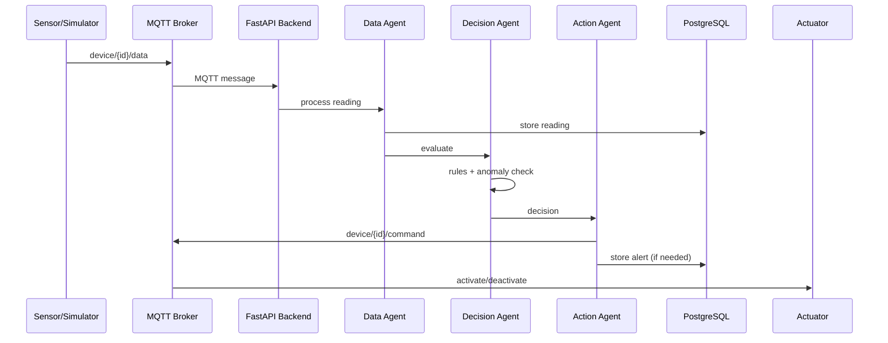

# Architecture

## Overview

EdgeBrain uses a **modular monolith** architecture with clear module boundaries. This choice is deliberate:

- **Modular monolith over microservices** because the system is designed to run locally on a single machine. Microservices add network complexity, operational overhead, and resource costs that don't make sense for an edge platform running on one host. Each module can be extracted into a microservice later if needed — the interfaces are clean enough.

## System Layers

```
┌─────────────────────────────────────────────────┐
│                   Dashboard                      │
│              (React + WebSocket)                 │
└──────────────────┬──────────────────────────────┘
                   │ HTTP / WS
┌──────────────────▼──────────────────────────────┐
│                FastAPI Backend                   │
│  ┌──────────┐ ┌──────────┐ ┌────────────────┐  │
│  │ REST API  │ │WebSocket│ │  Event Engine  │  │
│  └────┬─────┘ └────┬─────┘ └───────┬────────┘  │
│       │            │               │            │
│  ┌────▼────────────▼───────────────▼────────┐   │
│  │         Multi-Agent System                │   │
│  │  ┌─────────┐ ┌──────────┐ ┌───────────┐  │   │
│  │  │  Data   │ │ Decision │ │  Action   │  │   │
│  │  │  Agent  │→│  Agent   │→│  Agent    │  │   │
│  │  └─────────┘ └──────────┘ └───────────┘  │   │
│  └───────────────────┬───────────────────────┘   │
│                      │                           │
│  ┌───────────────────▼───────────────────────┐   │
│  │           Decision Engine                  │   │
│  │  ┌──────────┐ ┌────────────────────┐      │   │
│  │  │  Rules   │ │ Anomaly Detector   │      │   │
│  │  │(Threshold)│ │ (Z-Score, CPU)     │      │   │
│  │  └──────────┘ └────────────────────┘      │   │
│  └───────────────────┬───────────────────────┘   │
└──────────────────────┼───────────────────────────┘
                       │ MQTT
┌──────────────────────▼───────────────────────────┐
│              MQTT Broker (Mosquitto)              │
└──────────┬───────────────────────────┬───────────┘
           │                           │
┌──────────▼──────────┐    ┌───────────▼──────────┐
│  Device Simulator   │    │   ESP32 (optional)   │
│  (5 virtual devices)│    │   (real hardware)    │
└─────────────────────┘    └──────────────────────┘
```

## Data Flow



## MQTT Topics

| Topic Pattern | Direction | Purpose |
|--------------|-----------|---------|
| `device/+/data` | Device → Backend | Sensor readings |
| `device/+/command` | Backend → Device | Actuator commands |

## Decision Pipeline

1. **Data Agent** receives raw sensor reading
2. Validates value ranges
3. Stores in PostgreSQL
4. Passes to Decision Agent

5. **Decision Agent** evaluates through all registered strategies:
   - ThresholdStrategy: rule-based triggers
   - AnomalyDetector: z-score based anomaly detection
6. Returns list of Decision objects

7. **Action Agent**:
   - Creates alerts for warning/critical decisions
   - Publishes commands via MQTT
   - Logs to Redis event queue

## Database Schema

Three main tables:
- `sensor_readings` — time-series sensor data (with timestamp index)
- `device_commands` — actuator commands sent
- `alerts` — system alerts with severity levels
- `device_states` — current device state cache

## Plugin System

Add new decision strategies by implementing the `DecisionStrategy` interface:

```python
from app.ai.rules import DecisionStrategy, Decision

class MyStrategy(DecisionStrategy):
    @property
    def name(self) -> str:
        return "my_strategy"

    def evaluate(self, device_id, device_type, value, history):
        if value > MY_THRESHOLD:
            return [Decision(
                action="activate",
                device_id=device_id,
                params={"actuator": "alarm"},
                reason="Custom threshold exceeded",
                confidence=0.9,
            )]
        return []
```

Then register it:

```python
from app.agents.multi_agent import agents
agents.engine.add_strategy(MyStrategy())
```

## Scalability Path

If you need to scale beyond a single machine:
1. Extract the event engine into a separate service
2. Use TimescaleDB for better time-series performance
3. Add a message broker (RabbitMQ) between agents
4. Deploy dashboard behind Nginx with SSL
5. Use Kubernetes for orchestration

The modular monolith makes each of these steps straightforward.
